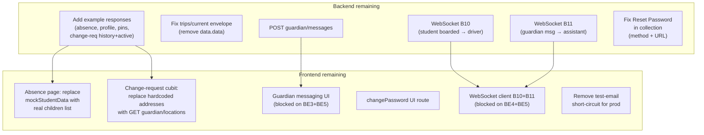

# SafeRoute — Collection diff & remaining work

## What changed between collections

**Old collection:** 36 endpoints | **New (latest) collection:** 40 endpoints

The backend delivered every endpoint that was flagged as "Not in Postman" in `backend_remaining_endpoints_work.md`:

| New endpoint | Notes |
|---|---|
| `GET /api/v1/school/location` (Driver folder) | Now has saved 200 example response |
| `POST /api/v1/absence` (Guardian) | Added — no saved example response |
| `DELETE /api/v1/absence` (Guardian) | Added — no saved example response |
| `GET /api/v1/guardian/location-change-requests` (history) | Added — no saved example response |
| `GET /api/v1/guardian/profile` | Added — no saved example response |

All other endpoints from the old collection are unchanged (same paths, same methods, same saved examples).

---

## Persistent bugs in the new collection (unchanged from old)

These were reported in `backend_remaining_endpoints_work.md` and still are not fixed:

- Guardian > Auth > "Reset Password": still `GET` method, URL still points at `/auth/resend-otp` instead of `/auth/change-password`
- Assistant > Auth > "Reset Password": same bug (GET + wrong URL)
- `GET /api/v1/guardian/pins`: still has no saved example response (field names `masterPin`/`tempPin` unconfirmed)
- `GET /api/v1/guardian/location-change-requests/active`: still no saved example response
- Double-envelope `data.data.tripActive` shape in `GET /api/v1/trips/current` — unresolved

---

## Frontend: what is already wired

The Flutter explore confirmed all 5 newly-added endpoints are **already implemented** in the frontend repositories:
- [`students_repository.dart`](lib/features/students/data/repositories/students_repository.dart) calls `GET /api/v1/school/location`
- [`absence/data/api_service.dart`](lib/features/absence/data/api_service.dart) calls `POST` + `DELETE /api/v1/absence`
- [`guardian_repository.dart`](lib/features/guardian/data/guardian_repository.dart) calls `GET /api/v1/guardian/profile`
- [`change_request_repository.dart`](lib/features/change_request/data/change_request_repository.dart) calls `GET /api/v1/guardian/location-change-requests`

The integration plan todos were all marked completed correctly.

---

## What remains: FRONTEND

**High priority (broken UX when real API is on):**
- **Absence page student list** — [`absence_page.dart`](lib/features/absence/presentation/absence_page.dart) still renders `StudentData.mockStudentData` hardcoded; it should pull children from `GuardianRepository.getProfile()` or a dedicated students call
- **Change-request saved addresses** — `_loadAddresses()` in [`change_location_cubit.dart`](lib/features/change_request/cubit/change_location_cubit.dart) is hardcoded mock; should call `GET /api/v1/guardian/locations` via `GuardianRepository.getLocations()`
- **Parse validation for new endpoints** — absence, profile, pins, and change-request history shapes have no Postman examples yet; integration should be tested/validated once backend adds those examples

**Medium priority (feature completeness):**
- **Guardian messaging UI** — `POST /api/v1/guardian/messages` is wired in `guardian_repository.dart` but no UI sends a message; waiting on both UI + backend socket (B11)
- **`changePassword` route in UI** — implemented in `auth_data_provider.dart` but `auth_repository.dart` has no method calling it, and no UI page routes to it
- **WebSocket B10** (student boarded/dropped → driver checkmarks) and **B11** (guardian messages → assistant inbox) — blocked on backend documenting the socket spec

**Low priority / decision needed:**
- **Test-email short-circuit** — `e@test.com`, `s@test.com`, `a@test.com` always bypass real API even when `USE_REAL_API=true`; fine for dev but should be removed before production
- **Server-side notification history** — `notifications_repository.dart` uses local store only; no `GET .../notifications` endpoint wired

---

## What remains: BACKEND

**Blocking (frontend can't validate parsing):**
- Add saved example responses for: `POST /api/v1/absence`, `DELETE /api/v1/absence`, `GET /api/v1/guardian/profile`, `GET /api/v1/guardian/pins`, `GET /api/v1/guardian/location-change-requests`, `GET /api/v1/guardian/location-change-requests/active`
- Fix double-envelope bug on `GET /api/v1/trips/current` — return flat `{ success, message, data: { tripActive, ... } }` not `data.data`

**Blocking for feature parity:**
- **`POST /api/v1/guardian/messages`** — not in either collection; must be implemented + documented (or confirmed as socket-only)
- **WebSocket B10** — student boarded/dropped notification → driver UI; define URL, subscription key, event names, payload
- **WebSocket B11** — guardian message delivery → assistant inbox; same spec needed

**Collection hygiene (won't break clients but should be fixed):**
- Fix Guardian + Assistant "Reset Password": method should be `POST`, URL should be `.../auth/change-password`
- Confirm `GET /api/v1/guardian/pins` field names (`masterPin` / `tempPin`, `int` vs `string`, pin length)
- Confirm `GET /api/v1/guardian/location-change-requests/active` response shape (`data.request` with `id`, `status`, `effectiveUntil`, `deadline` or null)

---

## Summary diagram

