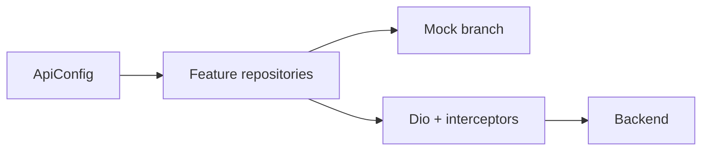

# SafeRoute: mock-first integration plan

## Goals

- **Today**: Same behavior as now — mock logins (`e@test.com` / `s@test.com` / `a@test.com` in [auth_repository.dart](lib/features/auth/data/repositories/auth_repository.dart)), `TripCubit` seeded with `ActiveTripState.exampleActiveState` ([trip_cubit.dart](lib/features/home/cubit/trip_cubit.dart)), `StudentData.mockStudentData`, `FakeApiService` for absence ([api_service.dart](lib/features/absence/data/api_service.dart)), change-request mocks in [change_location_cubit.dart](lib/features/change_request/cubit/change_location_cubit.dart).
- **Later**: Flip one switch + set `base_url` → real HTTP (and WebSockets where specified) per [backend_endpoints.txt](backend_endpoints.txt), with parsing aligned to `{ success, message, data }` envelopes.

## Architectural spine (recommended)

Introduce a small **API configuration** module (e.g. `lib/core/config/api_environment.dart`) consumed by repositories and Dio setup:

| Setting               | Purpose                                                                                                                                                             |
| --------------------- | ------------------------------------------------------------------------------------------------------------------------------------------------------------------- |
| `apiBaseUrl`          | e.g. `https://api.example.com` — **no trailing path**; code appends `/api/v1/...`                                                                                   |
| `useRealApi`          | `false` → repositories short-circuit to mocks / skip network                                                                                                        |
| `authRole` at runtime | You chose **single APK + role at login** — store selected role (`guardian` | `driver` | `assistant`) and build auth paths like `/api/v1/guardian/auth/login` per §A |

Use `**--dart-define=USE_REAL_API=true` and `--dart-define=API_BASE_URL=...`** for release builds; default both to mock-friendly values in debug.

**Single shared Dio**: one `Dio` with `BaseOptions(baseUrl: apiBaseUrl)`, inject `Authorization: Bearer` from [jwt_storage.dart](lib/features/auth/data/services/jwt_storage.dart), and later a **401 → refresh** interceptor if the backend exposes refresh (§A notes logout/refresh **NOT IN FILE** — keep stub until documented).

---

## Phase 1 — Auth §A (highest dependency)

**Source of truth**: [backend_endpoints.txt](backend_endpoints.txt) §A1–A5; [frontend_todos.txt](frontend_todos.txt) §1 and “AUTH: mobile app vs Postman”.

**Implement** (when `useRealApi`):

- Replace ad-hoc `localhost:5000` + `/login` in [auth_data_provider.dart](lib/features/auth/data/provider/auth_data_provider.dart) with:
  - `POST /api/v1/{role}/auth/login`, `verify`, `set-initial-password`, `resend-otp`, `change-password` (Bearer for A5).
- Parse **dual login outcomes** (A1): tokens in `data.access` / `data.refresh` vs OTP path (`remaining_time`, `detail`) — align with your stated answers (**role from JWT claims**; **refresh interceptor** — design for it even if refresh endpoint is still TBD).
- Map UI flows: OTP verify → A2 → A3; forgot/resend → A4; change password → A5 (guardian Postman **NEEDS WORK** — mirror driver URL shape until collection fixed).

**Keep mocks**:

- When `useRealApi == false`, keep current `passwordLogin` mock branches unchanged so demos keep working.
- When `useRealApi == true`, non-test emails hit real API; you can still keep test emails as explicit mock override if desired (document in code).

**Role strings**: Align API `guardian` with app `parent` nav ([frontend_todos.txt](frontend_todos.txt) §2) — single mapping function `apiRoleToAppRole` / `appRoleToApiPathSegment`.

---

## Phase 2 — Parent home / trip §B1, B12

**Current state**: [trip_repository.dart](lib/features/home/data/repositories/trip_repository.dart) expects `status` / `eta` / nested `licensePlate` — **different** from §B1 `TripDetails` + `TripUpdate`. [TripCubit](lib/features/home/cubit/trip_cubit.dart) never calls `syncTripState()` on init, so UI stays on example state.

**Plan**:

- Add `TripRepository.fetchTripState` **adapter**: map §B1 JSON (and envelope `data`) into `ActiveTripState` / `InactiveTripState` / `OfflineTripState`.
- When `useRealApi`: call `GET .../trips/current` (exact suffix TBD in §B — document constant `kTripsCurrentPath`).
- **Polling**: §B12 option 2 — timer 30–60s while `ActiveTripState` (your Q4 was unset; **suggested default: start with poll only**, add WebSocket when backend exposes `trip:location`).
- **Presentation**: Pass `busCoords` from state into map ([frontend_todos.txt](frontend_todos.txt) §3); add bus marker layer.

**Mock path**: If `useRealApi == false`, return `ActiveTripState.exampleActiveState` or last emitted state without HTTP.

---

## Phase 3 — Driver §B2–B5, B7

**New**: `DriverTripRepository` + cubit for start / GPS stream / end / active check; throttle GPS per your **Q6 answer (both 5s + distance)**.

**Mock**: Simulate trip session locally (timers + fake coords) when API off.

---

## Phase 4 — Assistant students §B6–B7

Replace list sources in [students_page.dart](lib/features/students/presentation/students_page.dart) / [student_viewer.dart](lib/features/home/presentation/components/staff/student_viewer.dart) with repository returning mock or `GET .../routes/students?direction=am|pm`; default direction **time-of-day** (your Q7).

**School card**: **B7** — prepend + append school row (your product note: start **and** end of list).

---

## Phase 5 — Assistant boarded / dropped §B8–B10

Wire actions to POST B8/B9; optional **B10** WebSocket for driver checkmarks (subscribe on driver session).

**Mock**: optimistic local updates + fake delays.

---

## Phase 6 — Messaging §C4, B11

`MessageCubit` + POST C4; assistant inbox via B11 WebSocket. **Q8 unresolved** — **suggested**: prefer HTTP `Authorization: Bearer` on WebSocket upgrade if server supports; else query token (document in provider).

**Mock**: in-memory message list + stream controller.

---

## Phase 7 — Absence §E2

[FakeApiService](lib/features/absence/data/api_service.dart) → real `Dio` methods for POST/DELETE E2; [service_locator.dart](lib/features/absence/domain/service_locator.dart) registers implementation based on `ApiConfig`.

**Mock**: keep current `FakeApiService` when API off.

---

## Phase 8 — Saved locations §C2–C3

**LocationsCubit** + merge server list with [SavedLocationsStore](lib/) (locate existing store); POST C3 for creates.

**Mock**: current local-only behavior until enabled.

---

## Phase 9 — Location change requests §D1–D4

Extend [change_location_cubit.dart](lib/features/change_request/cubit/change_location_cubit.dart): `loadActiveRequest`, submit D2, cancel D3, poll D4. State machine: idle  blocked  submitting  pendingReview  error per [frontend_todos.txt](frontend_todos.txt) §10.

**Clarify with backend** (already partially answered): blocking when `accepted` but not fulfilled — **infer from status only** (your Q9b, Q10b).

**Mock**: keep synthetic addresses until API on.

---

## Phase 10 — Pins §C1

Bind [PinCodePage](lib/) to repository `GET .../guardian/pins`; static UI becomes data-driven.

---

## Phase 11 — Profile §E3

`ProfileCubit` + `GET .../guardian/profile`; replace hardcoded fields.

---

## Phase 12 — Notifications / FCM §E1

Register token via **E1** after login when `useRealApi`; [notifications_repository.dart](lib/features/notifications/data/repositories/notifications_repository.dart) today only initializes FCM locally — extend with optional HTTP call (no-op if mock).

---

## Phase 13 — Role guard / 403 (§2)

Optional **RoleGuard** / global listener: on 403 or role mismatch from any authenticated call, force logout or error screen ([frontend_todos.txt](frontend_todos.txt) §2).

---

## Known backend gaps (do not block mocks)

- **Assistant auth** not in Postman (§A note) — assistant continues mock login until `/assistant/auth/...` exists.
- **Logout / refresh** not in file — client clears local tokens; server revoke when documented.
- **Guardian A5** Postman NEEDS WORK — implement client against documented POST shape; verify when collection fixed.

---

## Suggested implementation order (dependencies)

1. `ApiConfig` + shared Dio + JWT header
2. Auth §A + role-at-login path prefix
3. Trip B1 adapter + poll + map bus marker
4. E2 absence, E1 FCM, E3 profile (guardian vertical slice)
5. C2/C3 locations, C1 pins, C4 + B11 messaging
6. D1–D4 change requests
7. Driver B2–B5/B7 and assistant B6–B10 + sockets last

---

## What you will configure later (no code churn)

- `API_BASE_URL`  
- `USE_REAL_API=true`  
- Optional per-feature flags if you want to turn on guardian APIs before driver APIs

This keeps a **single codebase** path: repositories always decide mock vs real; UI stays unchanged aside from loading real data.