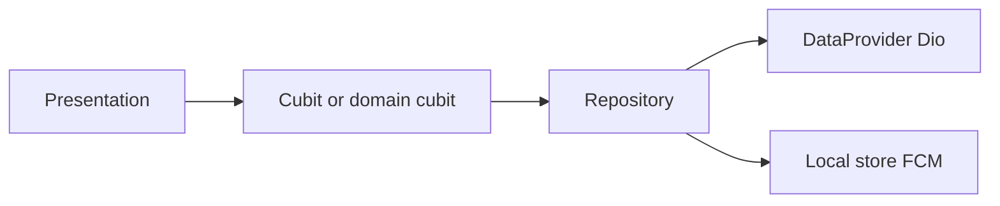

# SafeRoute Parent App — Status Report (v2)

This document is a review-oriented snapshot of the Flutter codebase: **features**, **layer completion** (presentation, cubit/domain logic, data), **mock vs live API** wiring, and **open questions** where product or backend contracts are still ambiguous.

---

## Purpose

- Give you a single place to see what is **built in the UI**, what has **business logic (Cubit)**, and what talks to **real HTTP** vs **mocks or local stores**.
- Align mental model with your folder layout: `presentation/`, `cubit/` (or `domain/` for absence), `data/` (`models`, `repositories`, `providers`, `services`).
- Surface **design decisions** that are not yet locked (polling vs socket, pin length, response shapes, etc.).

---

## Legend

| Tag | Meaning |
|-----|---------|
| **P** | Presentation (pages, widgets, navigation) |
| **C** | Cubit / domain logic (`Cubit`, state, orchestration) |
| **D** | Data layer (Dio `*DataProvider`, `Repository`, local `*Store`, FCM) |

**Mock** = hardcoded data, delays, or test credentials; **Partial API** = provider/repository exists but contract may differ from `todos.md`; **Local only** = no backend sync yet.

---

## Architectural overview

- **Global DI**: `AuthRepository` and `NotificationsRepository` are provided via `RepositoryProvider` in `lib/main.dart`. **Absence** uses GetIt in `lib/features/absence/domain/service_locator.dart` (`setupServiceLocator()` runs in `main()`).
- **HTTP**: `AuthDataProvider` and `TripDataProvider` use Dio with base URL `http://localhost:5000` (replace per environment when backend is ready).
- **Typical flow**: `Presentation` → `Cubit` → `Repository` → `DataProvider` (remote) and/or local `Store` / FCM.

---

## Feature catalog

### Authentication and session

| Layer | Status | Notes |
|-------|--------|--------|
| **P** | Done | Login, OTP, reset password, `AuthGate` routing to `HomePage` by role (`lib/features/auth/presentation/`). |
| **C** | Done | `AuthCubit` coordinates login, logout, OTP, password reset (`lib/features/auth/cubit/`). |
| **D** | Partial | `AuthDataProvider`: `/login`, `/logout`, `/otp`, `/reset-password`. **`passwordLogin` in `AuthRepository` is mock** (fixed test emails/passwords and mock JWTs). `jwtLogin` tries mock tokens first, then real `authData.jwtLogin`. |

**Mock vs API**: Email/password login is intentionally mock until backend is ready; swap by calling `AuthDataProvider.passwordLogin` from the repository and removing test branches.

**Primary paths**: `lib/features/auth/data/repositories/auth_repository.dart`, `lib/features/auth/data/provider/auth_data_provider.dart`, `lib/features/auth/presentation/auth_gate.dart`.

---

### Role-based shell and navigation

| Layer | Status | Notes |
|-------|--------|--------|
| **P** | Done | `HomeNav.forRole`: **parent** — Home, Locations, Notifications, Profile; **assistant** — Students, Notifications, Settings; **driver** — single Home tab (`lib/features/home/presentation/components/home_destination.dart`). |

**C / D**: Routing only; no separate cubit for shell.

---

### Parent home — map, trip strip, quick actions

| Layer | Status | Notes |
|-------|--------|--------|
| **P** | Done | `ParentHomeBody`: map (`MapView`), `TripStatus`, `TripPanel`, address tile, `ParentQuickActions` (`lib/features/home/presentation/components/parent/`). |
| **C** | Partial | `TripCubit`: initial state is **example active trip**; `syncTripState()` calls `TripRepository` but is **not wired on screen load**; dev-only `cycleState()` via tap on status (`TripStatus`). |
| **D** | Partial | `TripRepository` + `TripDataProvider` `GET /trip/current` — parses `status`, `eta`, `licensePlate`, `assistantInfo`, `driverInfo`. |

**Mock vs API**: Trip UI can be driven by mock/example state or by `/trip/current` once `syncTripState()` is called on init and on an interval. **Map does not draw bus polyline or live bus marker from API** (only device location + optional focus pin for staff).

---

### Driver home (staff map + student carousel)

| Layer | Status | Notes |
|-------|--------|--------|
| **P** | Done | `StaffHomeBody`: `MapView` with student focus, `StudentViewer` (`lib/features/home/presentation/components/staff/staff_home_body.dart`). |
| **C** | Partial | Same `TripCubit` as parent; no trip start/end actions bound. |
| **D** | Mock for students | `StudentData.mockStudentData` in `lib/features/absence/data/student_data.dart` — not from `GET assigned students`. |

---

### Assistant — Students tab

| Layer | Status | Notes |
|-------|--------|--------|
| **P** | Done | `StudentsPage`: search UI, `LocationTile`, `StudentPageTile` with **mock** students (`lib/features/students/presentation/students_page.dart`). |
| **C** | Missing | No `StudentsCubit` or list orchestration. |
| **D** | Missing | No repository/provider for assigned route students. |

---

### Staff quick actions (locate, Google Maps, end trip)

| Layer | Status | Notes |
|-------|--------|--------|
| **P** | Done | `StaffQuickActions`: locate on map, open Maps URL, **End trip** button present (`RoundedCtaButton`) (`lib/features/home/presentation/components/staff/staff_quick_actions.dart`). |
| **C** | Missing | No handlers calling trip start/end or status APIs. |
| **D** | Missing | No `POST Trip Start`, `POST Trip End`, or `POST Trip Status Update` wiring. |

---

### Student status (coming today / boarded / dropped)

| Layer | Status | Notes |
|-------|--------|--------|
| **P** | Partial | `StudentStatus` shows static “coming today” style text — **not** bound to `StudentStatus` model from API (`lib/features/home/presentation/components/staff/student_status.dart`). |
| **C** | Missing | — |
| **D** | Missing | No `POST` boarded / dropped off. |

---

### Messaging (parent ↔ assistant)

| Layer | Status | Notes |
|-------|--------|--------|
| **P** | Partial | Message icon opens dialogues (`show_messages_dialouge`, `TripPanel`); `CommunicationBar` / `LatestMessageViewer` on staff side — **UI only** (`lib/features/home/presentation/components/parent/trip_panel.dart`, `.../staff/communication_bar.dart`). |
| **C** | Missing | No message send cubit or stream handling. |
| **D** | Missing | No `POST guardianMessage`; no WebSocket client for assistant inbox. |

---

### Absence (mark / undo absent)

| Layer | Status | Notes |
|-------|--------|--------|
| **P** | Done | `AbsencePage` (`lib/features/absence/presentation/absence_page.dart`). |
| **C** | Done | `AbsenceCubit` + `AbsenceState` in `lib/features/absence/domain/`. |
| **D** | Mock | `AbsenceRepository` uses `FakeApiService` (delay + print). Commented Dio example in `lib/features/absence/data/api_service.dart`. Registered in GetIt (`service_locator.dart`). |

**Mock vs API**: Replace `FakeApiService` with a real provider matching your absence endpoints; keep repository interface stable for minimal UI churn.

---

### Saved locations (list, add, edit UX)

| Layer | Status | Notes |
|-------|--------|--------|
| **P** | Done | `LocationsPage` + tiles, undo snackbars, navigation to add flow (`lib/features/locations/presentation/locations_page_body.dart`, `add_location_page.dart`, `gmaps_search.dart`). |
| **C** | Missing | State lives in widgets + `SavedLocationsStore` listeners — no dedicated cubit. |
| **D** | Local only | `SavedLocationsStore` (`lib/features/locations/data/services/saved_locations_store.dart`) — **no** `GET savedLocations` / `POST addLocation` yet. |

---

### Change pickup / dropoff request

| Layer | Status | Notes |
|-------|--------|--------|
| **P** | Done | `ChangeRequestPage`, summary, confirmation, `AddLocationPage` with map drag marker (`lib/features/change_request/presentation/`). |
| **C** | Partial | `ChangeLocationCubit`: **mock** address list, **mock** `submitRequest()` (`lib/features/change_request/cubit/change_location_cubit.dart`). |
| **D** | Local handoff | `ChangeRequestStore` holds payload for confirmation flow — **no** `POST changeLocationDetour`. |

---

### Pin codes (guardian)

| Layer | Status | Notes |
|-------|--------|--------|
| **P** | Done | `PinCodePage` with master/temp fields (`lib/features/pin_code/presentation/pin_code_page.dart`). |
| **C** | Missing | — |
| **D** | Mock | Controllers seeded with example values; **no** `GET` pin codes API. |

**Open**: `todos.md` specifies 5-digit pins; UI uses 4-digit example strings — align with backend and UX.

---

### Profile (guardian)

| Layer | Status | Notes |
|-------|--------|--------|
| **P** | Done | Static layout: account info, children list, reset password button stub (`lib/features/profile/presentation/profile_page.dart`). |
| **C** | Missing | — |
| **D** | Missing | No GET/PATCH profile or children from API. |

---

### Settings

| Layer | Status | Notes |
|-------|--------|--------|
| **P** | Done | Language toggle and staff settings entry (`lib/features/settings/presentation/settings_page.dart`). |
| **C** | Done | `SettingsCubit`: loads/saves locale via `PersonalPrefs` (`lib/features/settings/cubit/settings_cubit.dart`). |
| **D** | Local | `SharedPreferences`-backed prefs — no server-side user preferences. |

---

### Notifications (in-app list + push)

| Layer | Status | Notes |
|-------|--------|--------|
| **P** | Done | `NotificationsPage` body with history list (`lib/features/notifications/presentation/`). |
| **C** | Done | `NotificationsCubit`: load history, FCM subscription, mark read on tab select (`lib/features/notifications/cubit/notifications_cubit.dart`). |
| **D** | Partial | `NotificationsRepository`: `NotificationHistoryStore` (local) + `FcmService` (incoming stream). **No server-synced notification inbox API.** |

---

## Mapping to `todos.md` (high level)

| Backend area (`todos.md`) | App readiness summary |
|---------------------------|------------------------|
| Driver: assigned students, school location | **P** mock lists / tiles; **C/D** not wired. |
| Driver: trip start, status update, trip active, trip end | **P** buttons/layout only where shown; **C/D** not implemented. |
| Assistant: boarded / dropped | **P** static status; **C/D** missing. |
| Assistant: socket messages | **P** partial UI; **C/D** missing. |
| Guardian: trip details / ETA / bus coords | **P** done; **C** partial (`TripCubit` + dev cycle); **D** partial (`GET /trip/current` shape may need alignment with `TripDetails`). |
| Guardian: pins, message, saved locations, detour | **P** mostly done; **C/D** mock or local except trip fetch attempt. |

---

## Switching from mocks to real APIs

1. **Keep repositories** as the seam: implement real Dio calls in `*DataProvider`, map JSON in repositories, inject the same repository into cubits.
2. **Remove or gate** mock branches (`AuthRepository` test emails, `FakeApiService`, mock lists in `ChangeLocationCubit`) via a single config (environment, flavor, or `bool useMockApi`) when you are ready — not required for this documentation pass.
3. **Align JSON** with `todos.md` or publish an OpenAPI snippet so `TripRepository` and future student/pin endpoints parse one contract.

---

## Questions for review (design / backend contract)

1. **Trip parent UX**: Should `TripCubit` poll `GET /trip/current` on an interval, or only after socket events? What is the canonical contract — `todos.md` `TripDetails` + `TripUpdate` vs current `TripRepository` fields (`status`, `eta`, nested `licensePlate`, `assistantInfo`, `driverInfo`)?
2. **Parent home**: One child vs multiple — today one address tile; should ETA/trip panel duplicate per child or stay single-bus?
3. **Pin codes**: Confirm length (5 vs 4) and whether temp pin rotates daily from server only.
4. **Driver location**: Confirm throttle (e.g. 5s) and whether assistant/parent updates share the same socket namespace as trip position.
5. **FCM**: Will the backend expose **POST device token** (and optional topics) so notification targeting is verified beyond local history?
6. **Auth**: Final login flow — email/password only, or OTP-first; should `passwordLogin` call the same `/login` as JWT refresh body shape?
7. **Absence**: Confirm REST verbs and paths for mark/undo vs commented stub in `api_service.dart`.
8. **Detour**: Confirm cutoff time (e.g. after 4:00) and idempotency for `changeLocationDetour` — client will need error messages for rejections.

---

## File index (quick reference)

| Area | Main paths |
|------|------------|
| Auth | `lib/features/auth/` |
| Home / trip / staff UI | `lib/features/home/` |
| Students (assistant tab) | `lib/features/students/presentation/` |
| Absence | `lib/features/absence/` |
| Locations | `lib/features/locations/` |
| Change request | `lib/features/change_request/` |
| Pin / profile | `lib/features/pin_code/`, `lib/features/profile/` |
| Settings | `lib/features/settings/` |
| Notifications | `lib/features/notifications/` |

---

*Generated for review alongside `todos.md`. Update both when backend contracts land.*
